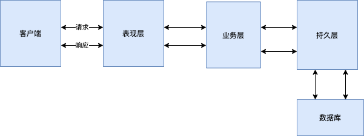
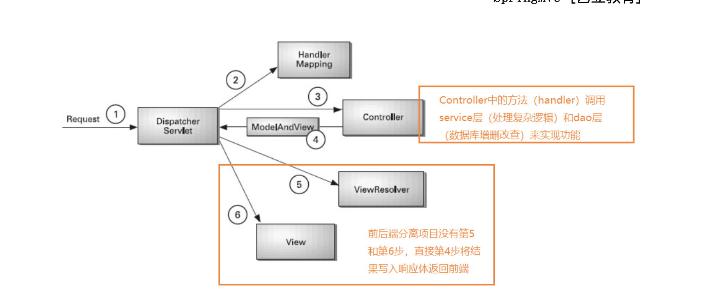
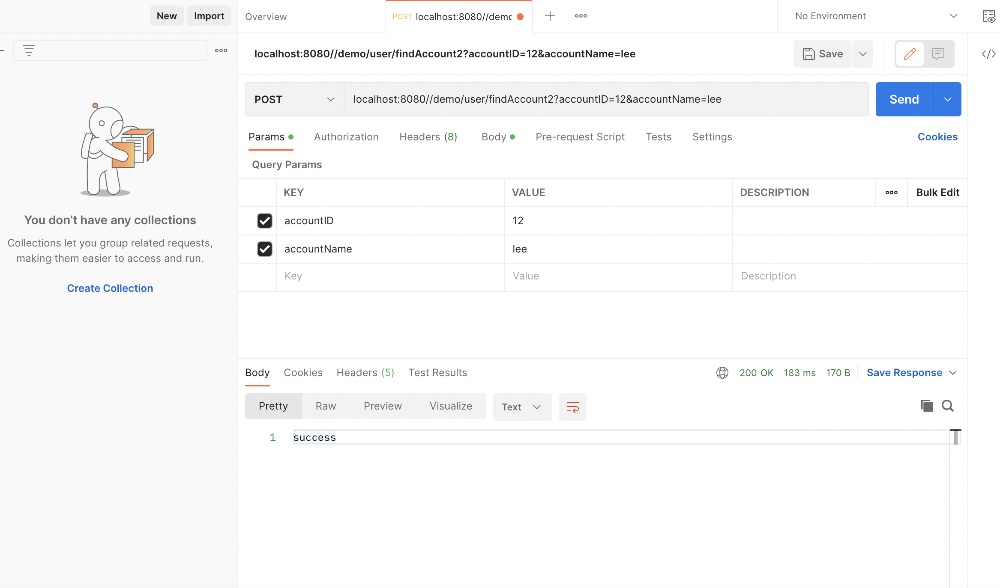
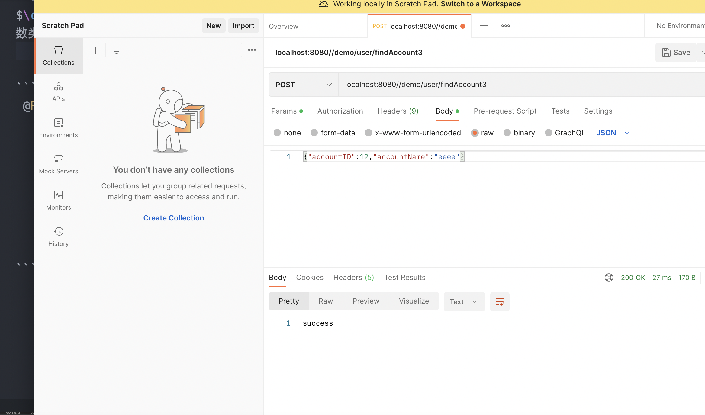
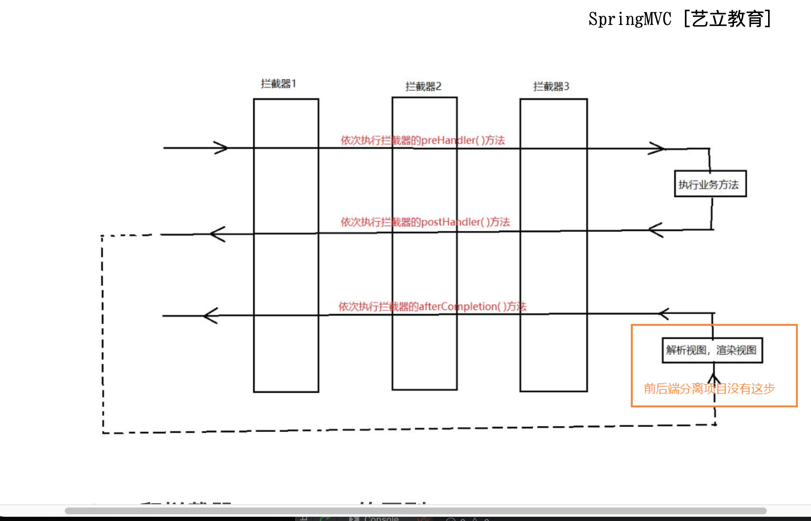
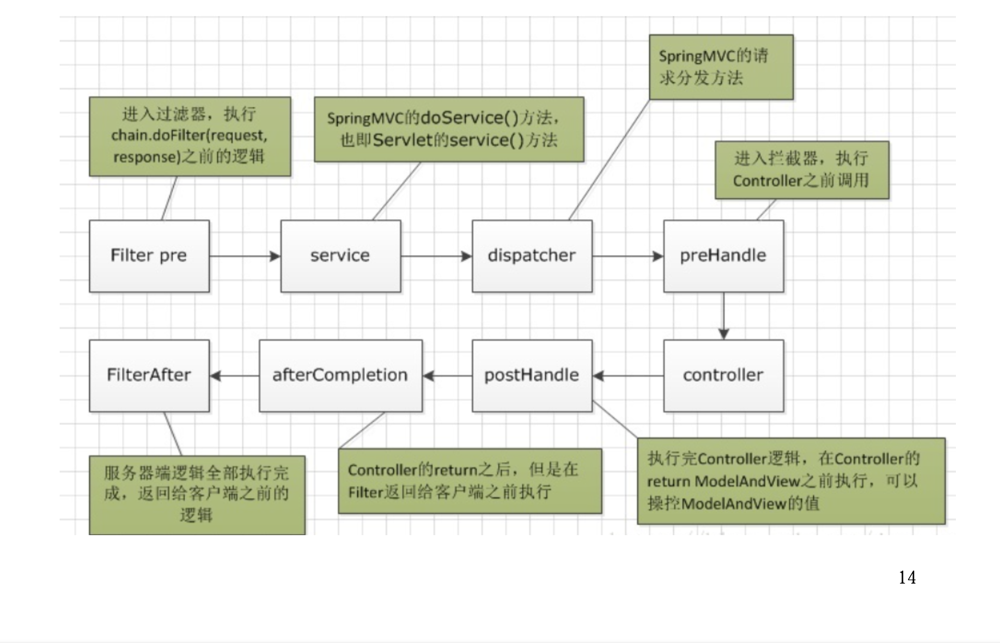

# SpringMVC框架

## SpringMVC概述

在后端项目架构中，系统标准的三层架构包括：表现层，业务层，持久层。

## 



- 表现层：也就是我们常说的web层，负责接收客户端请求，通常客户端使用http协议请求web层，web需要接收http请求，完成http响应
  
> MVC全名是ModelViewController，是模型（model）-视图（view）-控制器（controller）的缩写，是一种用于创建设计web应用程序表现层的模式，mvc每个部分各司其职

- 模型（model）：通常就是我们的数据模型。作用已发布用于封装数据
- 视图（view）：通常就是我们的jsp或者html。作用就是展示数据的。通常视图是依据模型数据创建的
- $\color{red}{控制器}$（controller）：是应用程序中处理交互的部分

### SpringMVC的优点：
  
1. 封装代码，维护成本低，耦合性低
在MVC模式中，三个层各施其职，所有如果一旦哪一层的需求发生变化，就只需要更改相应的层中的代码而不会影响到其它层中的代码
2. 有利于开发中的分工，提高开发效率
3. 和Spring中其他框架无缝集成，是其它web框架所不具备的
4. 功能强大的数据验证、格式化、绑定机制

## SpringMVC入门

```java
@Controller
@RequestMapping(path="/user")
public class HelloController {

    @RequestMapping("/hello")
    @ResponseBody
    public String sayHello(){
        System.out.println("Hello StringMVC");
        return "success_springboot";
    }

}
```

## SpringMVC基本原理


### 核心组件

1. DispatcherServlet:请求控制器（项目中处理web请求的大管家）
 > SpringMVC的核心就是DisptcheServlet,DisptcheServlet实质也是一个HttpServlet。DispatcherServlet负责将请求分发，所有的请求都有经过它来统一分发
2. Controller：每一个方法都是Handler，实际处理请求的组件
3. HandlerMapping：处理请求路径与实际处理请求的控制器的映射关系
> 在容器初始化时会建立所有的url和Controller的对应关系，保存到Map<url,Controller>中。tomcat启动时会通知Spring会遍历容器中的Bean，获取每一个Controller中的所有方法访问的url，然后将url和Controller保存到一个Map中，
> 这样可以根据request快速定位到Controller，因为最终处理request的是Controller中的方法，Map中只保留url和Controller中的对应关系，所有要根据request的url进一步确认Controller中的method，这一步工作的原理就是拼接Controller的url（Controller上@RequestMapping的值）和方法的url（method上@RequestMapping的值），与request的url进行匹配，找到匹配的那个方法；

4. ModelAndView：处理完请求后，封装了响应结果和视图信息的对象
5. ViewResolver：试图解析器，根据视图名得到具体负责显示的视图组件

### SpringMVC 请求处理流程



用户向服务器发送请求，请求会到DispatcherServlet，DispatcherServlet对请求URL进行解析，得到请求资源标识符（URI），然后根据该URI，调用HandlerMapping获得该Handler配置的所有相关的对象（包括一个Handler处理器对象，多个HandlerInterceptor拦截器对象）

调用handler方法前，会先经过拦截器（类似sevlet过滤器，springMVC自己的）
调用handler方法时，springmvc还会为我们做一些转换，格式化和验证的工作：
1. 数据转换：对请求消息进行数据转换。如String转换成Interger,Double等
2. 数据格式化：对请求消息进行数据格式化。如将字符串转换成格式化数字或格式化日期等
3. 数据验证：验证数据的有效性（长度、格式）

handler执行完成后，向DispatcherServlet返回一个ModelAndView对象；根据返回的ModlerAndView，选择一个适合的ViewResolver返回给DispatcherServlet；ViewResolver结合Model和View，来渲染试图，最后将渲染结果返回给客户端
注意：前后端分离项目，交互通过接口进行数据传递，我们会在handle方法上加@ResponseseBody注解，而是将方法返回值转换为json写入到Response对象的响应体中。

## SpringMVC常用注解

1. @Controller处理器
   用于标记在一个类上，使用它标记的类就是一个SpringMVC Controller对象。分发处理器（dispatcherServlet）将会扫描使用了该注解的类的方法，并检测该方法是否使用@RequestMapping注解的才是处理请求的处理器
2. @RequestMapping 映射请求
   SpringMVC使用@RequestMapping注解为控制器可以处理哪些URL请求
   >标记在类上：提供初步的请求映射请求信息，想对于WEB应用的根目录
   >标记在方法上：提供进一步的细分映射信息，相对于标记在类上的URL。
   >若类上未标注@equestMapping，则方法处标记的URL相对于WEB应用的根目录
作用：DispatcherServlet截获请求后，就通过控制器上@RequestMapping提供的映射因袭确定请求所应对的处理方法

补充：RequestMapping有个Method属性可以限制请求的方法类型

```JAVA
@RequestMappinh(value="/testUpload",methoid=RequestMethod.POST)
等同于
@PostMapping(value="/testUpload")

```
3. @RequestParam

作用：把请求中指定名称的参数赋值到控制器中的形参
属性
- value ：请求参数中的名称
- required：请求参数中是否提供此参数，默认值：true。表示必须提供，如果不提供将报错

```java
 @ResponseBody
 @RequestMapping("/params")
 public String getParams(@RequestParam("name")String username,@RequestParam("age")Integer age){
        System.out.println("getParamsMethod!");
        return username+age;

    }
    
```

4. @RequestBody

作用：用于获取请求体内容，直接使用得到的是key=value&key=value结构的数据。get请求方法不适用。属性：required：是否必须有请求体，默认值是true。当取值为true，get请求方式会报错，如果取值为false，get请求得到的是null

```java
    @ResponseBody
    @RequestMapping("/body")
    public String getBody(@RequestBody String body){
        return body;
    }
```

原理：
HandlerMethodArgumentResolver调用HttpMessageConverter就是从request对象中按照规则提取消息，转换为方法形参中声明的参数
HandlerMethodArgumentResolver   Handler方法参数解析器
HttpMessageConverter   Http消息转换器

5. @ResponseBody

作用：
其实是将方法返回值转为json格式的数据，写到响应报文体中。
原理：
HandlerMethodReturnValueHandler调用HttpMessageConverter将方法返回值按照一定的规则写到响应报文中的响应体中

```java
@RequestMapping("/login.do")
@ResponseBody
public Object login(String name, String password, HttpSession session) {
User user = userService.checkLogin(name, password);
return user;
```

@PathVaribale

作用：
用于绑定url中的占位符，例如：请求url中/delete/{id}

有时候需要在处理方法（也就是@RequestMapping注解的方法）中获取这个URL变量的具体值，并根据这个值（例如用户名）做相应的操作，Spring MVC提供的@PathVariable可以帮助我们：

```java
@ResponseBody
@RequestMapping("/testPathVariable/{username}")
public String userPathVariable(@PathVariable("username") String username){
        return username;
}
```
## SpringMVC参数绑定

就是请求参数与方法参数之间的绑定

### 常见的方法参数类型
- 普通参数：包括基本类型和String类型
- POJO:“Plain Old Java Object”即有无参构造函数，每个字段都有getter和setter的java类。

### 实战

1. url中的参数绑定
   只要我们的方法中的参数和请求参数一致，就会自动绑定

```java
@ResponseBody
@RequestMapping("/findAccount")
public String findAccount(int accountID,String accountName){
        System.out.println("查询了账户。。。"+accountID+","+accountName);
        return "success";
    }
```
2. 请求体中的参数绑定

| 编码         | 解释 |
| ----------- | ----------- |
| application/x-www-form-urlencoded      |  post请求默认格式，对内容按照urlencode编码, 并以 key1=val1&key2=val2的方式进行拼接|
| application/json   | 比键值对复杂的结构化数据        |
multipartform-data               |不对字符进行编码，使用二进制数据传输，一般用于上传文件，非文本的数据传输

- Content-Type属性为application/x-www-form-urlencoded


方法参数：
```java
 @ResponseBody
@RequestMapping("/findAccount")
    public String findAccount(int accountID,String accountName){
        System.out.println("查询了账户。。。"+accountID+","+accountName);
        return "success";
    }
@ResponseBody
@RequestMapping("/findAccount2")
public String findAccount(Account account){
        System.out.println("查询了账户。。。"+account.getAccountID()+","+account.getAccountName());
        return "success";
    }


package com.example.demo.controller;

public class Account {
    Integer accountID;
    String accountName;

    public Integer getAccountID() {
        return accountID;
    }

    public void setAccountID(Integer accountID) {
        this.accountID = accountID;
    }

    public String getAccountName() {
        return accountName;
    }

    public void setAccountName(String accountName) {
        this.accountName = accountName;
    }

    @Override
    public String toString() {
        return "Account{" +
                "accountID=" + accountID +
                ", accountName='" + accountName + '\'' +
                '}';
    }
}

```



   
- Content-Type属性为application/json时
$\color{red}{ 一定得用@RequestBody，且方法参数类型为实体类型}$


```java
 @ResponseBody
    @RequestMapping("/findAccount3")
    public String findAccount2(@RequestBody Account account){
        System.out.println("查询了账户。。。"+account.getAccountID()+","+account.getAccountName());
        return "success";
    }
```



- Content-Type属性为multipart/form-data时

```java
@ResponseBody
@RequestMapping("/findAccount4")
public String findAccount3(int accountID,String accountName){
    System.out.println("查询了账户。。。"+accountID+","+accountName);
        return "success";
    }
```


## SpringMVC文件上传

Springmvc支持文件上传，springmvc内部已经实现了客户端上传文件到服务端，我们只需要按照自己的需求springmvc的核心配置文件中配置文件上传的实体类

1. 文件配置

```java
spring.http.multipart.maxFileSize=10Mb     // 设置单个文件的大小
spring.http.multipart.maxRequestSize=10Mb  // 设置总上传的数据大小
```

2. 上传
   
```java
@Controller
@RequestMapping("/file")
public class FileController {

    @RequestMapping("/testUpload")
    @ResponseBody
    public String testUpload(MultipartFile multipartFile) throws IOException {
        System.out.println("originalFilename :"+
                multipartFile.getOriginalFilename());
        InputStream inputStream=multipartFile.getInputStream();
        System.out.println(inputStream.available());
        System.out.println("inputStream: "+inputStream);
        return "success";
    }
}
```

## SpringMVC中的拦截器

Spring MVC的处理器拦截器类似于Servlet开发中的过滤器Filter，拦截器本质上是面向切面编程(AOP),符合横切点的功能都可以放在拦截器中来实现，主要的应用场景包括（通过自定义拦截器实现）
- 登录验证：判断用户是否登录
- 权限验证：判断用户是否有权限访问资源，如校验token
- 日志记录：记录请求操作日志(用户ip，访问时间)，以便统计请求访问量
- 处理cookie、本地化、国际化、主题等
- 性能监控，监控请求处理时长等

### 实现

1. 自定义拦截器
   
```java
@Component
public class MyInterceptor implements HandlerInterceptor {

    //在请求处理之前进行调用(Controller方法调用之前)
    @Override
    public boolean preHandle(HttpServletRequest request, HttpServletResponse response, Object handler) throws Exception {
        System.out.println("执行了preHandler方法");

        return true;///如果设置为false时，被请求时，拦截器执行到此处将不会继续操作 如果设置为true时，请求将会继续执行后面的操作

    }

    //在处理请求之后进行调用
    @Override
    public void postHandle(HttpServletRequest request, HttpServletResponse response, Object handler, ModelAndView modelAndView) throws Exception {

        System.out.println("执行了postHandler方法");
    }

    //在整个请求结束之后被调用，主要是用于进行资源清理工作
    @Override
    public void afterCompletion(HttpServletRequest request, HttpServletResponse response, Object handler, Exception ex) throws Exception {
        System.out.println("执行了afterCompletion方法");
    }
}
```

2. 注册拦截器

```java
@Configuration
public class MyConfig  implements WebMvcConfigurer {

    @Autowired
    MyInterceptor myInterceptor;

    @Override
    public void addInterceptors(InterceptorRegistry registry) {
        InterceptorRegistration registration=registry.addInterceptor(myInterceptor);
        registration.addPathPatterns("/*"); //所有路径都被拦截

        registration.excludePathPatterns("/hello");//排除对一些路径的拦截


    }
    /* 
    /* 是拦截一层，不包含子路径 （如 /user 会被拦截到 ，/user/hello不会被拦截）
    /** 是拦截所有
    */
}
```

### 执行顺序



### filter和拦截器Interceptor的区别

1. 适用范围不同：Filter是Servlet容器规定的，只能使用在servlet容器中，而拦截器的shying范围就大得多
2. 使用资源不同：拦截器是属于spring的一个组件，因此可以使用spring的所有对象，如service对象，数据源，事物控制等，而过滤器就不行
3. 深度不同：Filter还在Servlet前后起作用。而拦截起能够深入方法前后，常抛出前后，因此拦截器具有更大的作用的更大的弹性，所有在spring框架中应该优先使用拦截器
   
   

### 关于Cookie的路径问题

某一资源创建cookie后，下次访问相同的path下的资源才会带上cookie

  
例1：
http://localhost:8080/login  创建登录cookie，path为"/"
http://localhost:8080/pay    能拿到登录cookie
http://localhost:8080/pay/order  能拿到登录cookie
例2：
http://localhost:8080/user/login  创建登录cookie，path为"/user"
      http://localhost:8080/pay    拿不到登录cookie
http://localhost:8080/user/order  能拿到cookie

我们可以在创建cookie的时候加上cookie.setPath("/");
这样我们创建的cookie就可以在整个项目内共享了。

