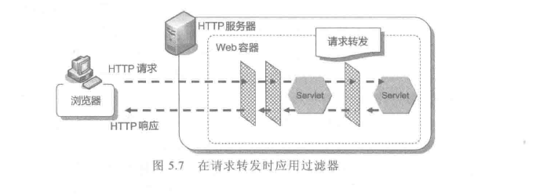
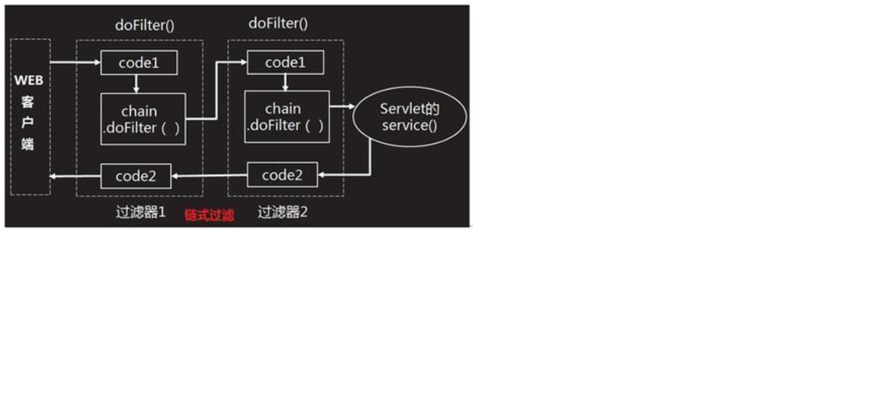

# Filter & Listener

## ServletConfig

Servlet 容器初始化 Servlet 时，会为这个 Servlet 创建一个 ServletConfig 对象，并将 ServletConfig 对象作为参数传递给 Servlet。通过 ServletConfig 对象即可获得当前 Servlet 的 Servlet 的初始化参数信息

一个 Web 应用中可以存在多个 ServletConfig 对象，一个 Servlet 只能对应一个 ServletConfig 对象，即 ServletConfig 的初始化参数仅对 Servlet 有效。

## ServletContext

当整个 Web 应用程序加载 Web 到容器之后，容器或生成一个 ServletContext 对象，作为整个应用程序的代表。

## Filter

可以实现用户在访问某个目标资源之前，对访问的请求和响应进行拦截。
当访问服务器资源时，过滤器可以将请求拦截下来，进行一些特定的处理，然后可以选择继续传递请求或者不放行

- 对用户请求进行身份认证
- 敏感字符过滤
- 修改请求内容或自定义响应内容



### 实现

1. 定义一个类，实现接口 Filter

```JAVA
public class FilterDemo1 implements Filter{
    .....
}
```

2. 复写方法

- init 在服务器启动后，会创建 Filter 对象，然后调用 init 方法，只执行一次
- doFilter 每一次请求被拦截时，会执行，执行多次
- destory 在服务器关闭后，Filter 对象被销毁，只执行一次

3. 配置拦截路径

- 通过 web.xml 进行拦截

```JAVA
    <!-- 对过滤器注册，为过滤器定义 name -->
    <filter>
        <filter-name>Filter1</filter-name>
        <filter-class>cn.itcast.filter.Filter1</filter-class>
    </filter>

      <!-- 配置过滤器拦截哪个web 资源 -->
    <filter-mapping>
        <filter-name>Filter1</filter-name>
        <!-- 拦截路径 -->
        <url-pattern>/hello.jsp</url-pattern>
    </filter-mapping>
```

- 注解

```JAVA
@WebFilter("/*")
```

1. 拦截所有资源：/\*
2. 拦截目录：/user/\* 访问/user 下的所有资源，过滤器都会被执行
3. 后缀名拦截：\*.jsp 访问所有后缀名为 jsp 资源时，过滤器都会被执行
4. 具体资源路径: /index.jsp 只有访问 index.jsp 资源时，过滤器才会被执行

### 过滤器执行流程

1. 执行过滤器
2. 执行放行后的资源
3. 回来执行过滤器放行代码下边的代码



- web.xml 配置：<filter-mapping>谁定义在上边，谁先执行
- 注解配置：按照类名的字符串比较规则比较，值小的先执行(字典顺序)
- 如果既有在 web.xml 中声明的 Filter，也有通过注解配置的 Filter，那么会优先执行 web.xml 中配置的 Filter

### 请求封装器

对于容器产生的 HttpServletRequest 对象，无法直接修改某些信息，比如 getParamter()能获得值，但是如果可能需要对一些数据进行处理，比如一些敏感词，于是有了 HttpServletRequestWrapper,编写想要重新定义的方法,其实是一个包装类，详见设计模式

```JAVA

public class MyRequest extends HttpServletRequestWrapper {
    public MyRequest(HttpServletRequest request) {
        super(request);  //必须调用父类构造函数，传入HttpServletRequest 实例
    }

    //需要改变哪个写哪个
    @Override
    public String getParameter(String name) {
        return super.getParameter(name)+"from ";
    }
}

```

```JAVA
@WebFilter(filterName = "TestC",value = "/*")
public class MyFilter3 implements Filter {
    @Override
    public void init(FilterConfig filterConfig) throws ServletException {
        System.out.println("初始化：MyFilter3");

    }

    @Override
    public void doFilter(ServletRequest servletRequest, ServletResponse servletResponse, FilterChain filterChain) throws IOException, ServletException {


        System.out.println("执行：MyFilter3");
        filterChain.doFilter(new MyRequest((HttpServletRequest) servletRequest), servletResponse);

    }

    @Override
    public void destroy() {
        System.out.println("销毁：MyFilter3");

    }
}


```

## Listener

- 概念：Web 容器管理 Servlet/JSP 相关的对象生命周期，通过 listener 可以监听 web 服务器中的某一个执行动作，再执行预先定义的动作
- 功能：监听 servletContext(servlet 上下文，对应整个 web 应用),session,request 等对象创建消亡或者修改

### 常用 Listener

使用配置：

-web.xml:

```JAVA
<listener>
<listener-class>…ContextLoaderListener</listener-class>
</listener>
```

- 注解：

```JAVA

@WebListener
```

1. ServletContextListener：监听 ServletContext 对象的创建和销毁

```JAVA
@WebListener
public class MyServletContextListener implements ServletContextListener {

    @Override
    public void contextDestroyed(ServletContextEvent sce) {
        System.out.println("ServletContext 销毁了");
    }

    @Override
    public void contextInitialized(ServletContextEvent sce) {
        System.out.println("ServletContext 初始化了");
    }

}

```

2. HttpSessionListener:监听 HttpSession 对象的创建和销毁

```JAVA
@WebListener
public class MyHttpSessionListener implements HttpSessionListener {

    @Override
    public void sessionCreated(HttpSessionEvent se) {
        System.out.println("新会话创建了");
    }

    @Override
    public void sessionDestroyed(HttpSessionEvent se) {
        System.out.println("有会话销毁了");
    }
}

```

3. ServletRequestListener:监听 ServletRequest 对象的创建和销毁

```JAVA
@WebListener

public class MyServletRequestListener implements ServletRequestListener {

    @Override
    public void requestDestroyed(ServletRequestEvent sre) {
        System.out.println("有request对象销毁了");
    }

    @Override
    public void requestInitialized(ServletRequestEvent sre) {
        System.out.println("有request对象创建了");
    }
}

```
