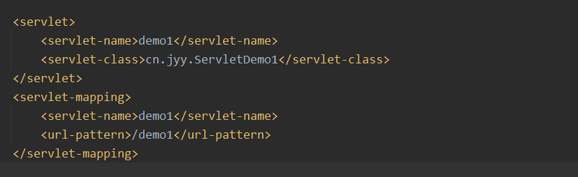
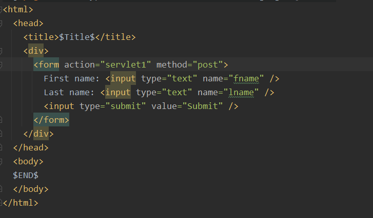

# servlet

## URI URL URN

1. URI 统一资源标识符
2. URN 通过名字标识资源
3. URL 通过地址来标识资源

URL(统一资源定位符)格式

protocol://hostname:port/path/?query
协议://主机名或域名：端口/路径/？参数键值对

## web 容器

> 不同的容器负责不同的工作，对于 web 服务器而言，是一个 Java 写的程序，运行与 JVM 之上，不仅持有对象，还负责对象的生命周期与相关服务的连接

## 请求与响应的基本例子


1. 浏览器对 HTML 服务器发出请求
2. HTTP 服务器收到请求，请求转由 Web 容器处理，Web 容器会剖析 HTTP 请求内容，创建各种对象（如 HttpServletRequest,HttpServletResponse,HTTPSession 等）
3. Web 容器由请求的 URI 决定要使用哪个 Servlet 来处理请求（开发人员要定义 URI 与 Servlet 的对应关系）
4. Servlet 根据请求对象（HttpServletRequest）的信息决定如何处理，通过响应对象（HttpServletResponse）来创建响应
5. Web 容器与 HTTP 服务器沟通,HTTP 服务器将相关响应对象转换为 HTTP 响应并传回给浏览器

> servlet 执行在 Web 容器之中，Web 容器由服务器上的 JVM 启动，JVM 本身就是就是服务器上的一个可执行程序，当一个请求来到时，Web 容器会为每一个请求分配一个线程（Thread）
> 需要注意的一点：Web 容器可能会使用同一个 Servlet 实例来服务多个请求，也就是说多个请求下，多个线程在共同存取一个对象，因此值得注意线程安全问题，避免引发数据错乱。

## 网络分层

> 应用层：发的是什么
> 传输层：什么方式发 TCP OR UDP
> 网络层：发到哪里（找路线 携带地址 IP）
> 链路层：真实的路线，有纠错机制

> IP 地址&MAC 地址
> MAC 地址：内部网络使用
>
> > 重要的区别在于，IP 地址划分时基于地理区域，换了不同地方，即便是同一台硬件设备，IP 地址一定不一样，可以理解为和地理位置有关；而 MAC 地址不依赖于地理区域，换了不同地方，只要还是同一台硬件设备，MAC 地址就不会变，它只和硬件设备有关。

> DSN 协议是什么
>
> > 域名解析成 IP 地址

### HTTP 协议

> Hyper Text Transfer Protocol 超文本传输协议位于应用层功能：客户端和服务器端通信时，发送数据和接收数据的格式

### 请求

> Http 请求由请求行，消息报头，请求正文三部分构成


#### 请求行

> 请求行由请求 Method，URL,HTTP Version 三部分构成
> 举例： GET /example.html HTTP/1.1(CRLF)

##### 请求 Method

请求 Method 有以下几种

1. GET: Request-URL 所标识的资源
2. POST:在 Request-URI 所标识的资源后增加新的数据
3. HEAD：请求获取由 Request-URI 所标识的资源的响应消息报头
4. PUT: 请求服务器存储或修改一个资源，并用 Request-URI 作为其标识
5. DELETE：请求服务器删除 Request-URI 所标知的资源
6. TRACE: 请求服务器会送收到的请求信息，主要用于测试或诊断
7. CONNECT:保留将来使用
8. OPTIONS：请求查询服务器的性能，或者查询与资源相关的选项和需求

##### HTTP 请求头

消息报头由一系列的键值对组成，允许客户端向服务器发送协议附加信息获得客户端自身信息


##### HTTP 请求正文

只有在发送 POST 请求时才会有请求正文，GET 方法并没有请求正文


### HTTP 响应

HTTP 响应也由三部分组成，包括状态行，消息报头，响应正文


#### 状态行

状态行由三部门组成，包括 HTTP 协议的版本，状态码，以及对状态码的文本描述，例如

> HTTP/1.1 200 OK(CRLF)

状态代码有三个数字组成

1. 第一个 1.1 代表 HTTP 协议的版本
2. 第二个数字定义了响应的类别，且有五种可能取值：
   > 1xx:指示信息，-表示请求已经接收，继续处理
   > 2xx:成功-表示请求已经成功接收、理解、接受
   > 3xx:重定向-要完成请求必须进行更进一步的操作
   > 4xx:客户端错误-请求由语法错误或请求无法实现
   > 5xx:服务端错误-服务器未能实现合法的请求
3. 第三个数字数字代表了常见状态代码、状态描述，说明
   > 200: OK-客户端请求成功
   > 400: Bad Request-客户端请求由语法错误，不能被服务器所理解
   > 401: Unauthorized-请求未经授权，这个状态代码必须 WWW-Authenticate 报头域一起使用
   > 403：Forbidden-服务器收到请求，但是拒接提供服务
   > 404: Not Found -请求资源不存在
   > 500: Internal Server Error 服务器发生不可预期的错误
   > 503: Server Unavailable -服务器不能处理当前客户端的请求，一段时间后，可能恢复正常

#### HTTP 响应报头

与请求头部类似，为响应报文添加了一些附加信息


### 响应正文

### HTTP 响应报文


## Servlet

> 运行在服务器软件（如 tomcat）中的小小程序，Servlet 是一个接口，定义了 Java 类被浏览器访问大（tomcat 识别）的规则

### Servlet 的生命周期

一个抽象接口

1. 被创建：执行 init 方法，只执行一次
   > 默认情况下，第一次被访问的时候，Servlet 被创建。Servlet 在内存中只存在一个对象，Servlet 是单例的，尽量不要在 Servlet 中定义成员变量，如果定义了成员变量，也不要对其修改值
2. 提供服务：执行 Service 方法，执行多次

   > 每次访问 Servley 时。Service 方法都会被调用一次

3. 被销毁：执行 destory 方法，只执行一次

   > Servlet 被销毁时执行，服务器正常关闭时，才会执行 destory 方法。
   > destory 方法在 Servlet 被销毁之前执行，一般用于释放资源

### servlet 层级关系

<div align=center>
</div>

> GenericServlet:将 Servlet 接口中其他的方法做了默认空实现，只讲 service()方法作为抽象。定义 Servlet 类时，可以继承 GenerticServlet，实现 service()方法即可

> HttpServlet：对 http 协议的一种封装，简化操作，它已经实现了 service 方法，并在方法根据请求方法类型的不同，分别调用 do 方法（如 doGet，doPost）
> 我们可以直接自定义类继承 HttpServlet，复写 doGet/doPost 方法

```java
protected void doGet(HttpServletRequest request,HttpServletResponse response){}
protected void doPost(HttpServletRequest request, HttpServletResponse response){}
```

> servlet 处理流程：请求到达自定义 servlet，先执行 service 方法（会去调用父类 Httpservlet 的 service 方法），父类 HttpServlet 的 service 方法根据请求方法类型的不同，分别调用对应 do 方法（如 doGet、doPost），如果子类重写 HttpServlet 的 doGet 和 doPost 方法，那么实际调用的是子类的 doGet 和 doPost 方法。

其中 request 和 response 是 tomcat 服务器创建，在调用该方法时传入的，封装的信息分别是请求信息和响应信息。

### Servlet 的配置

当编写好 Servlet 后，接下来要告诉 Web 容器关于 Servlet 的一些信息。自 JAVA

这里以“/”开头，是绝对路径，Web 应用的路径，详见路径详解

#### @WebServlet


#### Web.xml



### 两种 HTTP 请求方法： GET 和 POST

GET:-从指定的资源请求数据

> /test/demo_form.php?name1=value1&name2=value2

POST:-从指定的资源提交要被处理的数据

> POST /test/demo_form.php HTTP/1.1
> Host: runoob.com
> name1=value1&name2=value2

## HttpServletRequest

1. 获得请求方式 GET OR POST

   ```JAVA
   String method=request.getMethod()
   ```

2. 获取请求参数

   ```JAVA
   String paramter=request.getQueryString()//这个方法只对GET请求有效，获得的是URL中的请求参数

   String paramter=request.getParamter(String name);//不管是GET 或者是POST请求都可以使用

   Map<String,String[]> request.getParamterMap();//获得所有参数的map集合
   ```

   注意:常见的 POST 提交数据的方式有以及下几种:

   - 浏览器的原生表单，如果不设置 enctype 属性，最终无论是 post 还是 get 方法，就都会以 application/x-www-form-urlencode 方式提交数据。除此之外，使用 Jquery 封装的 Ajax 技术$.post{}里面如果没有设置 contentType 的参数那么做种也还是会以 application/x-www-form-urlencoded 方式提交数据。这种类型提交的数据将按照"key=value1&key2=value2"的方式进行编码放在请求体中（是 get 就放在 url 后面）

   **这种情况下就用第二种方法来获得请求参数值，换句话说，第二种方法只能获得以 application/x-www-form-urlencode 方式提交的数据**

   - 表单的 enctype 数据值为 multipart/form-data，一般用来上传文件，这种类型提交的数据将按照某种奇怪的方式进行编码放在请求体中。

3. 获取请求 URL

   ```JAVA
   StringBuffer request.getRequestURL();
   ```

4. 获取协议以及版本

   ```JAVA
   String request.getProtocol()
   ```

5. 获取客户机的 IP 地址

   ```JAVA
   String request.getRemoteAddr()
   ```

6. 获取请求头数据

   ```JAVA
   Enumeration<String> request.getHeaderNames();//获取所有的请求头名称

   String request.getHeader(String name);//通过请求头的名称获取请求头的值
   ```

7. 请求转发：一种在服务器内部的资源跳转方式

   ```JAVA
   request.getRequestDispatcher(String path).forward(ServletRequest request,ServletResponse response)
   ```

   会保留转发之前 doGet/doPost 中的 request response,并转到对应 Servlet 的 doGet，doPost 方法中处理

   **浏览器地址栏路径不会发生变化**
   **只能转发到当前服务器内部资源中**

## HttpServletResponse

### 概述

由 tomcat 服务器创建，Servlet 中处理，最终返回给客户端（或浏览器），到达客户的形式就是响应报文

可以使用 HttpServletResponse 来对浏览器进行响应，在大部分情况下，使用 SetContentType()设置响应类型，使用 getWriter（）取得 PrintWriter 对象，而后使用 PrintWriter 的 println()等方法输出 HTML

### 方法

1. 设置响应行
   响应行格式:HTTP/1.1 200ok
   设置状态码

   ```JAVA
   response.setStatus(int sc)
   ```

2. 设置响应头

   ```JAVA
   response.setHeader(String name,String value);
   response.setHeader("Content-type","application/json")
   ```

3. 设置响应体

   ```JAVA
   PrintWriter pw=response.getWriter();
   response.setContentTye("text/html;charset=utf-8")
   pw.write("Hello XO!")
   ```

4.重定向

```JAVA
response.sendRedirct("/day15/responseDemo2");
```

重定向的特点:

- 地址栏发生变化
- 重定向可以访问到其他站点（服务器）的资源，也可以访问自己的资源
- 重定向是两次请求。不能使用 request 对象来共享数据

## JAVA WEB 中路径的问题

### 概念

> WEB 项目真正运行的地方是服务器上，项目会被打包到 tomcat 下运行，而路径其实是依据这个打包后的项目（简单来说，网址就是路径）

服务器（站点）根目录：http://localhost:8080/(以 tomcat 服务器为例)
Web 应用根目录：http://localhost:8080/项目名

> 前端页面在服务器上的地址：
>
> > Web 应用根目录/[前端页面所在的文件夹]/前端页面名
> >
> > > eg：前端页面直接在 WebContent 目录下（可能不同，IDEA 中就是 web 目录：Web 应用根目录/前端页面名
> > > 前端页面直接在 WebContent 目录下的一级或多级文件夹下：Web 应用的根目录/文件夹层级/前端页面名

> Servlet 在服务器上的地址：
>
> > Web 应用的根目录/Servlet 名
> >
> > > ps:不需要加包名

### JSP 与 Servlet 中的相对路径和绝对路径

#### 相对路径

在 web 项目中，若我们在访问路径的最前端不加上“/”，那就是相对路径。这个路径就是当前文件所在的路径



idea 中目录如下


> 比如这个 action 中，action="Servlet1"，由于这个文件是前端文件，这个文件是直接在 web 文件下，所以 index.jsp 所在文件夹的路径是 http://localhost:8081/项目名
> 所以表单提交时，会将相对路径与 servlet1 拼接，也就是 http://localhost:8080/项目名/Servlet1
> 但是如果前端资源存放在 web 的下一级文件夹中，这样访问就会出错

#### 绝对路径

绝对路径的使用方式就是在路径的开始上加一个“/”，若在路径开始处加上了一个“/”，那相对路径前缀就会被“清零”，路径从最初位置开始

> 在 jsp 与 Servlet 页面中“/”有不同的意思
>
> - 在 JSP 中：“/”代表服务器（站点）根目录
> - 在 Servlet 中：“/”代表 web 应用的根目录

需要注意的是：请求转发与请求重定向的用法有所不同

```JAVA
request.getRequestDispatcher("/a/a.jsp").forward(request,response);
```

因为是服务器内部转发，所以"/a/a.jsp"中第一个"/"是 Web 应用根路径->相当于 http://localhost:8080/项目名/a/a.jsp

```JAVA
response.sendRedirect("/b/b.jsp");
```

因为重定向中的方法是传递给浏览器，用于重新发送请求，而在浏览器端“/”代表服务器目录，所以上述会重定向到 http://localhost:8080/b/b.jsp,
**注意,浏览器地址栏是没有项目名的！所以会出错**
