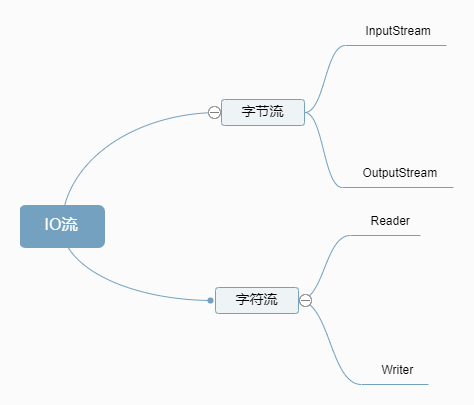

# 字节流

## 定义

> Java 对数据的操作是通过流的方式，操作流的类都在 IO 包中。按流分为输入流，输出流，按流的操作类型分为两种输入流，输出流。



## FileInputStream 与 FileOutStream

### FileInputStream 的使用

> 1.read() 方法一次读取一个字节并且返回值是一个 int，效率很低仅做示范用

```Java
FileInputStream fis=new FileInputStream("aaa.txt")
int b;
while((b=fis.read())!=-1){
    System.out.println((char)b);
}
```

### FileOutputStream 的使用

> write() 方法向目的地址写数据 仅做示范用

```Java
FileOutputStream fos=new FileOutputStream("bbb.txt");
fos.write(97);
fos.write(98);
fos.write(99);
fos.write(100);
fos.write();
fos.close;
```

### 一些改进方案

#### 一次性读取一定长度

```Java
FileInputStream fis=new FileInputStream("xxx.map3");
FileOutputStream fos=new FileOutputStream("yyy.map3");
int len;
byte[] arr=new byte[1024*8];
while((len=fis.read(arr))!=-1){
    fos.write(arr,0,len);
}
fis.close;
fos.close;
```

#### 使用 JDK 为我们封装好的类

> 1.BufferedInputStream
>
> > 内置了一个缓冲区(数组)，会一次性从文件中读取 8192 个，存在缓冲区，直到缓冲区中所有的都被使用过，才重新从文件中读取 8192 个
>
> 2.BufferedOutputStream
>
> > 内置了一个缓冲区，会一个一个字节将自己的数据赋给 BufferedOutputStream 的缓冲区中（发生在内存中，速度很快）直到缓冲区写满，BufferedOutputStream 才会把缓冲区的数据一次性写到文件中
