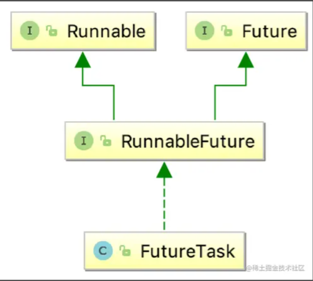

# 线程池

## 线程与进程的关系

- 进程：是资源分配的最小单位
- 进程：程序执行流的最小执行单位

多线程是实现异步的一种技术

一个进程可以有 1~n 个线程

## 创建线程的三个方法

##### 1. 继承 Thread 类

```java
package com.example.demo.thread;

public class ThreadTest extends Thread{

    public void run(){
        System.out.println("自定义线程的run方法执行了");
    }

    public static void main(String[] args) {
        new ThreadTest().start();
    }

}

```

##### 2. 通过实现 Runnable 接口

```java
public class RunnableThreadTest implements Runnable{

    @Override
    public void run() {
        System.out.println("自定义线程的run方法执行了");
    }

    public static void main(String[] args) {
        RunnableThreadTest runnableThreadTest=new RunnableThreadTest();
        new Thread(runnableThreadTest,"新线程1").start();
    }
}


```

###### 3. 通过 Callable 接口(重写的方法可以有返回值)

1.  自定义实现 Callable 接口，相较于实现 Runnable 接口的方式，重写的方法可以有返回值，并且可以抛出异常

```java

public class MyCallable implements Callable<String> {

    @Override
    public String call() throws Exception {
        Thread.sleep(5000);
        return "testCallable";
    }
}

```

2. 创建 FutureTask 对象

```java
MyCallable myCallable=new MyCallable();
FutureTask futureTask=new FutureTask(myCallable);
```



###### 一些解释

Future 最主要的作用是，比如一些比较耗时的操作，如果我们一直在原地等待方法返回，显然不明智，可以将耗时操作放在子线程里去执行，再通过 Future 去控制子线程执行的计算过程最后获取到计算结果

FutureTask 作为继承了 Runnable 接口和 Future 接口的 RunnableFuture 实现类，所以 FutureTask 既可以作为 Runnable 被线程执行，又可以作为 Future 作为 Callable 的返回值

FutureTask 有两个重要方法

> - isDone() 返回一个布尔值，表示 call 方法是否执行结束，不阻塞
> - get() 返回 call 方法的返回值，如果 call 方法未执行完会阻塞

3.

```java
new Thread(futureTask).start();

while(!futureTask.isDone()){
            System.out.println("未完成");
        }
System.out.println(futureTask.get());
```

## JDK 中的线程池

### 线程池

1. 提供了一个装线程的容易，现取现用，用完即还。避免了创建于销毁额外开销，提高了响应速度
2. 提供了一个任务队列，队列中保存着所有需要线程来执行的任务

### 线程池的体系结构

\- java.util.concurrent.Exectuor: 负责线程的使用与调度的根接口
\-- ExecutotService 子接口：线程池的主要接口

### ThreadPoolExecutor 的构造方法

#### 源码：

```java
    public ThreadPoolExecutor(int corePoolSize,
                              int maximumPoolSize,
                              long keepAliveTime,
                              TimeUnit unit,
                              BlockingQueue<Runnable> workQueue,
                              ThreadFactory threadFactory,
                              RejectedExecutionHandler handler) {
        if (corePoolSize < 0 ||
            maximumPoolSize <= 0 ||
            maximumPoolSize < corePoolSize ||
            keepAliveTime < 0)
```

#### 线程池的 7 个参数

##### corePoolSize：线程池维护线程的最小数量。（线程池刚创建完，线程数是 0，来任务才会创建线程）

##### maximumPoolSize：线程池维护线程的最大数量

##### keepAliveTime：线程池维护线程所允许的空闲时间。一个线程如果处于空闲状态，并且当前的线程数量大于 corePoolSize，那么在制定时间后，这个空闲线程会销毁（补充：但是如果调用了线程池的 allowCoreThreadTimeOut(true)方法，在线程池中的线程数不大于 corePoolSize 时，keepAliveTime 参数也会起作用，直到线程池中的线程数为 0）

##### unit: 线程池维护线程所允许的空闲时间的单位，keepAliveTime 的计量单位

##### workQueue：线程池所使用的缓冲队列，缓冲队列的长度决定了能够缓冲的最大数量

##### ThreadFactory: 创建一个新线程时使用的工厂，可以用来设定线程名

##### handler：线程池对拒绝任务的处理策略

#### 线程池任务执行流程


提交任务后，线程池先判断线程数是否达到了核心线程数(corePoolSize)。如果未达到线程数，则创建核心线程数，否则就执行下一步
接着线程池判断任务队列是否满了，如果没满，则将任务添加到任务队列中，等待调度线程调起否则，执行下一步
接着因为任务队列满了，线程池就判断线程数是否达到了最大线程数，如果未达到，则创建非核心线程处理任务；否则就执行 RejectedExecutionHandler

注意：在刚刚创建 ThreadPoolExecutor 的时候，线程并不会立刻启动，而是等到有任务提交时才会启动，除非调用了 prestartCoreThread/prestartAllCoreThreads 事先启动核心线程。再考虑到 keepAliveTime 和 AllowCoreThreadTimeOut 超时参数的影响，所以没有任务需要执行的时候，线程池的大小不一定是 corePoolSize

#### 非阻塞队列与阻塞队列（先进先出）

非阻塞队列有如下：
PriorityQueue（优先级队列，支持排序）
ConcurrentLinkedQueue（基于链表的并发队列）
阻塞队列：
ArrayBlockingQueue（基于数组的并发阻塞队列，需要指定容量）
LinkedBlockingQueue(基于链表的阻塞队列，容量无限)
SynchronousQueue（同步阻塞，不村塾元素，添加元素操作和获取元素必须同时存在，否则会阻塞）
DelayedWorkQueue（延迟队列，容量无限制）

###### 阻塞队列和非阻塞队列的区别：

1. 当队列是空的，阻塞队列的 take 方法从队列取元素会被阻塞
2. 当队列是满的，阻塞队列的 put 方法往队列里添加元素的操作会被阻塞

###### 阻塞队列与非阻塞队列的共有方法

1. add(E e):将元素 e 插入到队列末尾，如果插入成功，则返回 true；如果插入失败（即队列已满），则会抛出异常
2. remove():移除队首元素，若移除成功，则返回 true;如果移除失败(队列为空)，则会抛出异常
3. offer(E e):将元素 e 插入到队列末尾。如果插入成功，则返回 true。如果插入失败(即队列已满)，则返回 false
4. poll():移除并获取队首元素，若成功，则返回队首元素，否则返回 null
5. peek():获取队首元素，若成功，则返回队首元素，否则返回 null

###### 阻塞队列的 4 个独有方法

1. put(E e):put 方法用来向队尾存入元素，如果队列满，则等待
2. take():take 方法用来从队首取元素，如果队列为空，则等待
3. offer(E e,long timeout,TimeUnit unit):offer 方法用来向队尾存入元素，如果队列满，则等待一定的时间，当时间期限达到时，如果还没有插入成功，则返回 false；否则返回 true
4. poll(long timeout,TimeUnit unit):poll 方法用来从队首取元素，如果队列空，则等待一定的时间，当时间期限达到时，如果取不到，则返回 null;否则返回取得的元素

###### 代码演示

ArrayBlockingQueue

```java
public class ArrayBlockingQueueTest {
    public static void main(String[] args) throws InterruptedException {
        ArrayBlockingQueue<String> arrayBlockingQueue=new ArrayBlockingQueue<>(2);
        arrayBlockingQueue.add("a");
        arrayBlockingQueue.add("b");
        arrayBlockingQueue.put("c");
    }
}
```

SynchronousQueue

```java
public class SynchronousQueueTest {
    public static void main(String[] args) throws InterruptedException, IOException {
        final SynchronousQueue<String> queue = new SynchronousQueue<>(true);

        Thread put = new Thread(new Runnable() {
            @Override
            public void run() {
                System.out.println("put1 thread start");

                try {
                    queue.put("put");
                } catch (InterruptedException e) {
                    e.printStackTrace();
                }

                System.out.println("put1 thread end");
            }
        }, "put1");

        Thread take = new Thread(new Runnable() {
            @Override
            public void run() {
                System.out.println("take1 thread start");

                try {
                    queue.take();
                } catch (InterruptedException e) {
                    e.printStackTrace();
                }
                System.out.println("take1 thread end");
            }
        },"take1");

        take.start();

        Thread.sleep(200);

        put.start();

        System.in.read();


    }
}

```

take()若没有遇到 put()操作就是阻塞的，反则亦然。

#### JDK 为我们提供的线程池工具类 Executors

1. newFixedThreadPool(int nThreads)创建一个核心线程数和最大线程数相同的线程池
2. newSingleThreadExecutor()创建一个单一线程的线程池，也就是说池中就一个线程。
3. newCachedThreadPool()创建一个不缓存任务的线程池，来一个任务，必须要有一个空闲线程来执行该任务，如果没有，则会创建一个线程
4. newScheduledThreadPool(int corePoolSize) 创建一个固定大小的可调度线程池，支持定时操作和周期性操作。

上述四种常用方法主要使用了一下三种工作队列：

> linkedBlockingQueue
>
> > 基于链表的无界阻塞队列(其实最大容量为 Integer.MAX),按照 FIFO 排序，由于该队列的近似无界性，当线程池中线程数量达到 corePoolSize 后，再有新任务进来，会一直存入该队列，而不会去创建新线程直到 maxPoolSize,因此使用该工作队列时，参数 maxPoolSize 其实是不起作用的

> SynchronousQueue
>
> > 一个不缓存任务的阻塞队列，添加一个任务必须等到有线程来取出这个任务。也就是新任务进来时，不会缓存，而是直接被调度执行该任务，如果没有可用线程，则创建新线程，如果线程数量达到 maxPoolSize，则执行拒绝策略

> DelayedWorkQueue
>
> > 一个具有优先级的延迟阻塞队列

注意：开发尽量使用 ThreadPoolExecutor 的构造方法来创建线程池，为了让我们更明确线程池的几个参数可能造成的影响，比如 Executors.newFixedThreadPool(3)实际创建过程是调用 ThreadPoolExecutor 的构造函数：

```java
ExecutorService fixedThreadPool =new ThreadPoolExecutor(3, 3,
0L, TimeUnit.MILLISECONDS,
        new LinkedBlockingQueue<Runnable>(), Executors.defaultThreadFactory()
, new ThreadPoolExecutor.AbortPolicy());

```

无界的处理队列可能会消耗非常大的内存，甚至 OOM，我们可以使用指定容器 $\color{red} {ArrayBlockingQueue} $来代替

#### 线程池的主要方法

execute(Runnable r):提交任务交给线程池运行
submit(Callable r )：提交任务，能够返回执行结果
getQueue(): 获取线程池的阻塞队列
shutDown(): 关闭线程池，等待任务都执行完
shutDownNow(): 关闭线程池，不等待任务执行完
getPoolSize(): 线程池当前线程数量
getActiveCount():当前线程池中正在执行任务的线程数量

##### 线程池创建

```java
public class ExecutorsTest {

    @Test
    public void fixedThreadPool() throws InterruptedException {
        ExecutorService fixThreadPool = Executors.newFixedThreadPool(2);
        for (long i = 0; i < 10; i++) {
            final long index = i;
            fixThreadPool.execute(new Runnable() {
                @Override
                public void run() {
                    System.out.println(Thread.currentThread().getName() + " : " + index);

                    try {
                        Thread.sleep(20000);
                    } catch (InterruptedException e) {
                        e.printStackTrace();
                    }
                }
            });

        }
        Thread.sleep(30000);

    }

    /**
     * 不缓存任务，来任务时，创建线程来执行任务
     */

    @Test
    public void cachedThreadPool() throws InterruptedException {
        ExecutorService cachedThreadPool = Executors.newCachedThreadPool();

        for (long i = 0; i < 10; i++) {
            final long index = i;
            cachedThreadPool.execute(new Runnable() {
                @Override
                public void run() {
                    System.out.println(Thread.currentThread().getName() + ":" + index);
                    try {
                        Thread.sleep(3000);
                    } catch (InterruptedException e) {
                        e.printStackTrace();
                    }
                }
            });
        }

        Thread.sleep(30000);
    }

    /**
     * 有一个核心线程去执行任务
     */
    @Test
    public void singThreadExecutor() throws InterruptedException {
        ExecutorService singThreadExecutor = Executors.newSingleThreadExecutor();
        for (long i = 0; i < 10; i++) {
            final long index = i;
            singThreadExecutor.execute(new Runnable() {
                @Override
                public void run() {
                    System.out.println(Thread.currentThread().getName() + ":" + index);
                    try {
                        Thread.sleep(3000);
                    } catch (InterruptedException e) {
                        e.printStackTrace();
                    }
                }
            });
        }

        Thread.sleep(30000);

    }
    /**
     * 创建一个定长线程池，支持定时及周期性任务执行
     * * */

    @Test
    public void newScheduledThreadPool() throws InterruptedException {
        ScheduledExecutorService scheduledPool=new ScheduledThreadPoolExecutor(1);

        scheduledPool.schedule(new Runnable() {
            @Override
            public void run() {
                System.out.println(Thread.currentThread().getName() + ":delay 5 seconds");
            }
        },5, TimeUnit.SECONDS);

        Thread.sleep(10000);
    }


      @Test
    public void testSubmit() throws ExecutionException, InterruptedException {
         ExecutorService singThreadExecutor =  Executors.newSingleThreadExecutor();

        FutureTask task= (FutureTask) singThreadExecutor.submit(new Callable<String>() {

            @Override
            public String call() throws Exception {

                Thread.sleep(2000);
                return "call executor";
            }
        });


        while (!task.isDone()){
            System.out.println("not yet");
        }
        System.out.println(task.get().toString());
    }

}

```

#### 线程池拒绝策略

线程池对拒绝任务的处理策略。在 ThreadPoolExecutor 里面定义了 4 种 handler，分别是

1. CallerRunsPolicy: 在调用者线程中运行当前被丢弃的任务
2. AbortPolicy: 对拒绝任务抛弃处理，并且抛出异常
3. DiscardPolicy：对拒绝任务直接无声抛弃，没有异常信息
4. DiscardOldestPolicy：对拒绝任务不抛弃，而是抛弃队列里面等待最久的一个任务，然后把拒绝任务加到队列

###### CallerRunsPolicy

```Java
public class CallerRunsPolicyDemo {

    public static void main(String[] args) throws InterruptedException {
        ThreadPoolExecutor threadPoolExecutor = new ThreadPoolExecutor(1, 1, 5,
                TimeUnit.SECONDS, new ArrayBlockingQueue<Runnable>(1), new ThreadPoolExecutor.CallerRunsPolicy());

        for(int i=0;i<10;i++){
            //Thread.currentThread() Thread.currentThread()
            threadPoolExecutor.execute(new MyRunnable("index =  "+i));
        }

        Thread.sleep(30000);


    }

}

--------------------

index =  1 main
index =  0 pool-1-thread-1
index =  3 main
index =  2 pool-1-thread-1
index =  5 main
index =  4 pool-1-thread-1
index =  7 main
index =  6 pool-1-thread-1
index =  9 main
index =  8 pool-1-thread-1

Process finished with exit code 0

```

##### AbortPolicy

```java
public class AbortPolicyDemo {

    public static void main(String[] args) {
        ThreadPoolExecutor threadPoolExecutor = new ThreadPoolExecutor(1, 1, 5, TimeUnit.SECONDS,
                new ArrayBlockingQueue<Runnable>(1), new ThreadPoolExecutor.AbortPolicy());

        for(int i=0;i<10;i++){
            threadPoolExecutor.execute(new MyRunnable("index =  "+i));
        }

    }
}

---------------------------------------------------
index =  0 pool-1-thread-1
Exception in thread "main" java.util.concurrent.RejectedExecutionException: Task com.example.demo.threadpool.MyRunnable@85ede7b rejected from java.util.concurrent.ThreadPoolExecutor@5674cd4d[Running, pool size = 1, active threads = 1, queued tasks = 1, completed tasks = 0]
	at java.util.concurrent.ThreadPoolExecutor$AbortPolicy.rejectedExecution(ThreadPoolExecutor.java:2047)
	at java.util.concurrent.ThreadPoolExecutor.reject(ThreadPoolExecutor.java:823)
	at java.util.concurrent.ThreadPoolExecutor.execute(ThreadPoolExecutor.java:1369)
	at com.example.demo.threadpool.AbortPolicyDemo.main(AbortPolicyDemo.java:14)
index =  1 pool-1-thread-1

```

##### DiscardPolicy

```java
public class DiscardPolicyDemo {

    public static void main(String[] args) {
        ThreadPoolExecutor threadPoolExecutor = new ThreadPoolExecutor(1, 1, 5, TimeUnit.SECONDS,
                new ArrayBlockingQueue<Runnable>(1));

        threadPoolExecutor.setRejectedExecutionHandler(new ThreadPoolExecutor.DiscardPolicy());

        for(int i=0;i<10;i++){
            threadPoolExecutor.execute(new MyRunnable("index "+i));
        }
        threadPoolExecutor.shutdown();
    }
}

```

##### DiscardOldestPolicy

```java
public class DiscardOldestPolicy {

    public static void main(String[] args) {
        ThreadPoolExecutor threadPoolExecutor = new ThreadPoolExecutor(1, 1, 5, TimeUnit.SECONDS,
                new ArrayBlockingQueue<Runnable>(1));

        threadPoolExecutor.setRejectedExecutionHandler(new ThreadPoolExecutor.DiscardOldestPolicy());

        for(int i=0;i<10;i++){
            threadPoolExecutor.execute(new MyRunnable("index "+i));
        }
        threadPoolExecutor.shutdown();
    }
}


---------------------------

index 0 pool-1-thread-1
index 9 pool-1-thread-1

Process finished with exit code 0

```

##### 自定义拒绝策略

```java
public class MyRejectionHandler implements RejectedExecutionHandler {
    @Override
    public void rejectedExecution(Runnable r, ThreadPoolExecutor executor) {
        System.out.println(r.toString() + "被拒绝了，阻塞主线程");

        try {
            executor.getQueue().put(r);
        } catch (InterruptedException e) {
            e.printStackTrace();
        }
    }
}

```

]这里是利用了阻塞队列的 put 操作在队列满时会阻塞。

```java
public class DiscardPolicyDemo {

    public static void main(String[] args) {
        ThreadPoolExecutor threadPoolExecutor = new ThreadPoolExecutor(1, 1, 5, TimeUnit.SECONDS,
                new ArrayBlockingQueue<Runnable>(1));

        threadPoolExecutor.setRejectedExecutionHandler(new MyRejectionHandler());

        for(int i=0;i<10;i++){
            threadPoolExecutor.execute(new MyRunnable("index "+i));
        }
        System.out.println("aaaa");

        threadPoolExecutor.shutdown();
    }
}

```

#### 自定义线程工厂

实现 ThreadFactory 接口，重写 newThread() 方法

```java
public class MyThreadFactory implements ThreadFactory {


    private static final AtomicInteger poolNumber = new AtomicInteger(1);
    private final ThreadGroup group;
    private final AtomicInteger threadNumber = new AtomicInteger(1);
    private final String namePrefix;

    MyThreadFactory() {
        SecurityManager s = System.getSecurityManager();
        group = (s != null) ? s.getThreadGroup() :
                Thread.currentThread().getThreadGroup();
        namePrefix = "pool-" +
                poolNumber.getAndIncrement() +
                "-thread-";
    }


    @Override
    public Thread newThread(Runnable r) {
        Thread t = new Thread(group, r,
                namePrefix + threadNumber.getAndIncrement(),
                0);
        System.out.println("有新线程创建了");
        if (t.isDaemon())
            t.setDaemon(false);
        if (t.getPriority() != Thread.NORM_PRIORITY)
            t.setPriority(Thread.NORM_PRIORITY);
        return t;

    }
}

```

#### 合理设置线程池的线程数

没有固定答案！
一般来说：CPU 密集型任务应配置尽可能小的线程，如配置 Ncpu+1 个线程的线程池。由于 IO 密集型任务线程并不是一直在执行任务，则应配置尽可能多的线程，如 2\*Ncpu。

可供参考的公式如下：

Nthreads=Ncpu\*Ucpu\*(1+WC)

上式各变量的含义：
Nthreads：线程数
Ncpu：CPU 核心数
Ucpu：目标 CPU 利用率
WC：等待时间和计算时间的比例

最好以项目实际情况为主，先设定预期，比如我期望的 CPU 利用率是多少，负载是多少（单位时间等待任务的数量），GC 频率多少之类的指标后，再通过测试不断的调整到一个合理的线程数。
