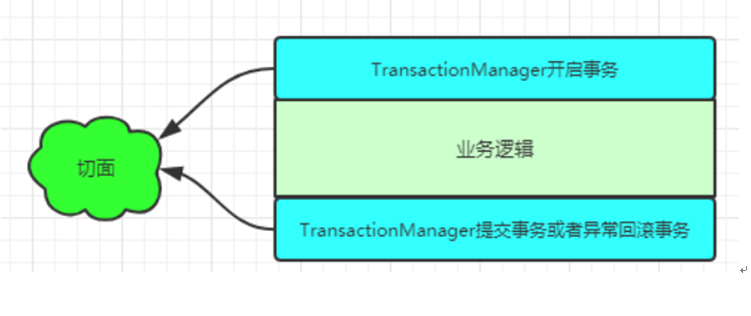
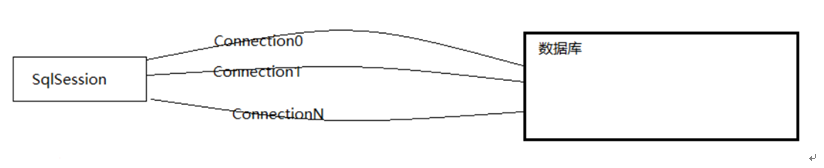
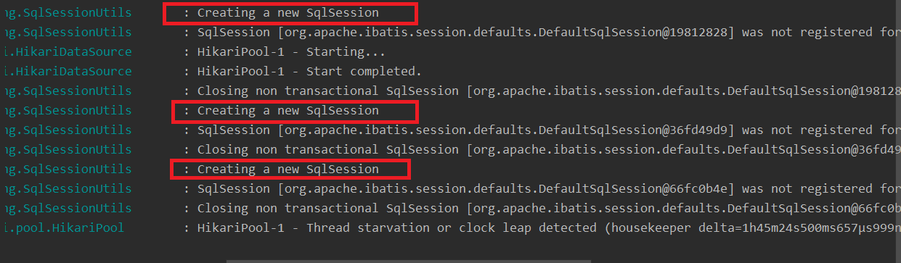
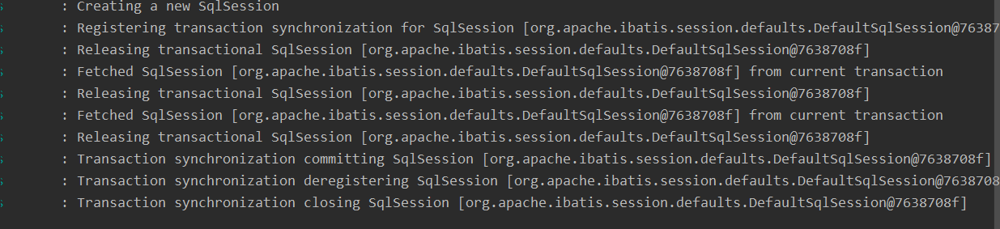

# SpringBoot 事务和 Mybatis 缓存

## SpringBoot 事务

### 事务的概念

事务指逻辑上的一组操作，组成这组操作的各个单元，要么全部不成功。从而确保了数据的准确与安全。

### 事务的四大特性

- 原子性
- 一致性
- 隔离性
- 持久性

### 事务的隔离级别

- 串行化
- 可重复读
- 读已提交
- 读未提交

### SpringBoot 中事务实现方式

> 编程式事务：在业务代码中添加事务控制代码，这样事务控制机制就叫做编程式事务
> 声明式事务：通过 xml 或者注解配置的方式达到事务控制的目的，叫做声明式事务

### 注解方式开启事务(@Transaction 注解)

SpringBoot 中已经默认对 JDBC、MyBatis 开启了事务，引入这些依赖的时候，事务就默认开启，只需要一个@Transcational 就可以了

#### @Transcational 生效的原理

1. 在 Spring 的 bean 的初始化过程中，通过判断 bean 的方法是否标有事务注解(@Transactional)来决定是否创建代理对象，如果一个类中任意方法含有事务注解，那么这个对象就会被代理
2. 核心思想就是 Aop，bean 的方法就是切点，@Transactional 注解对应的解释器会根据注解信息解析出需要增强的逻辑，此处的切面逻辑类似于@Around，会在方法的前后执行一些事务的相关操作(设置隔离级别，传播行为，定义一些回滚或提交的条件等)



#### Connection 和 SqlSession 的关系

- Connection：连接数据源的物理链路，一般项目都会使用连接池来提高性能
- SqlSession：一个与数据库的会话对象，基于数据库连接。SqlSession 在执行 sql 语句时会根据调度策略，选取其中一个 Connection

##### Connection

Connection 作为一个特定数据库的会话，在一个连接的上下文中，sql 语句被执行，然后结果被返回
一次在 Connection 上下文中可以执行多个操作，
默认情况下，一个 connection 被创建时，默认是 auto-commit(一条语句执行开始前会开启事务，语句执行完就会结束事务)。虽然多个操作在同一个 Connetion 上下文中执行，但是它们自己只和自己有关系，但是互相是没有关系的

如果我们想多个操作，同时成功或者同时失败，那就要进制 auto-commit 模式，然后手动 commit。这样一次 Connetion 中的几个操作，就具有同时成功或者同时失败的关系

##### Transaction

事务，正式 N 个操作执行时，同时成功或者同时失败的关系的具象

##### SqlSession

SqlSession 是 Mybatis 中定义的，用来表示与关系数据库的一次会话，会话定义了各种具体的操作、查询、数据更新(包含保存、更新、删除)操作。而这些操作都在与数据库建立会话的基础上进行。SqlSession 可以看做是对 Connection 更加高级的抽象



<br> 没使用事务时，每个 sql 操作都会创建 SqlSession </br>

在没使用@Transactional 注解标记方式法，SpringBoot 整合 Mybatis 的情况下，每个方法的每个 sql 操作都会创建一个与数据库的会话，即 SqlSession 对象，它是基于数据库连接 Connection 对象的会话对象

##### 开启 SqlSession 的操作日志

```
logging.level.org.mybatis.spring.SqlSessionUtils=debug
```

##### 创建测试方法

```java

@Override
public List<User> queryUserList() {
    userMapper.queryUserList();
    userMapper.queryUserList();
    return userMapper.queryUserList();
}

```

##### 查看日志



###### 使用事务

使用事务时，事务方法内的所有 sql 操作公用一个 Session 对象，共同提交或者回滚，包括方法内容调用的非事务方法内部 sql 操作

```java
@Override
@Transactional
public List<User> queryUserList() {
    userMapper.queryUserList();
    userMapper.queryUserList();
    return userMapper.queryUserList();
}
```



### @Transactional

#### 属性

| 属性        | 说明                                                                                                                                                   |
| ----------- | ------------------------------------------------------------------------------------------------------------------------------------------------------ |
| timeout     | 设置一个事务所允许执行的最大时长(单位：秒) 如果                                                                                                        |
| readOnly    | 事务只读，指对事务性资源进行了只读操作，不能修改                                                                                                       |
| rollbackFor | 指定对那些异常回滚事务。默认情况下，如果没有抛出任何异常，或者抛出了检查时异常，依然提交事务，而 rollBackFor 可以 控制事务在排除某些检查时异常回滚事务 |
| propagation | 指定事务传播行为，一个事务方法被另外一个事务方法调用时，必须指定事务该如何传播                                                                         |
| isokation   | 指定事务隔离级别                                                                                                                                       |

#### @Transactional 的注意事项

1. @Transactional 注解默认在抛出 RuntimeException 或者 Error 时才会触发事务的回滚，常见的非 RuntimeException 是不会触发事务的回滚的。我们平时做业务处理时，需要捕获异常，所以可以手动抛出 RuntimeException 异常或者添加 rollbackFor=Exception.class (也可以指定相应异常)


$\color{red} SQLException 并不是 RuntimeException 的子类 $

```java
public class RuntimeException extends Exception {
    static final long serialVersionUID = -7034897190745766939L;

    /** Constructs a new runtime exception with {@code null} as its
     * detail message.  The cause is not initialized, and may subsequently be
     * initialized by a call to {@link #initCause}.
     */
    public RuntimeException() {
        super();
    }
```

```java

public class SQLException extends java.lang.Exception
                          implements Iterable<Throwable> {

    .....

    }

```

###### <mark>为什么有时候发生了 SqlException 也会回滚

当我们在项目开发中加入了 Spring 框架以后，SQLException 会被 Spring 捕捉后抛出其他自定义的 RuntimeException

2. 只有 public 修饰的方法才会生效

3. （在同一个类中）当无事务方法调用有事务的方法时事务不会生效（a 方法内通过 this.b()),调用的 this（被代理对象）的方法不会增强),而有事务的方法去调用其他方法，无论被调用的方法有无事务，且时候出现异常(有异常需要能够抛出不被捕获)，都触发事务。

#### 配置事务的隔离级别

隔离级别是指若干个并发的事务之间的隔离程度。TransactionDefinition 接口定义了五个隔离级别的常量：

1. $\color{red} {TransactionDefinition.ISOLATION_DEFAULT:}$ 这是默认值，表示使用底层数据库的默认隔离界别。 对于 Mysql 数据库就是可重复读对于 Mysql 数据库就是可重复读 TransactionDefinition.ISOLATION_REPEATABLE_READ,对于 Oracle 数据库而言,TransactionDefinition.ISOLATION_READ_COMMITTED。对应的枚举值为(Isolation.DEFAULT)

2. TransactionDefinition.ISOLATION_READ_UNCOMMITTED:该隔离级别表示一个事务可以读取另一个事务修改但还没有提交的数据。该级别不能防止脏读，不可重复读和幻读，因此很少使用该隔离级别。对应的枚举值为：(Isolation.READ_UNCOMMITTED)

3. TransactionDefinition.ISOLATION_READ_COMMITTED: 该隔离级别表示一个事务只能读取另一个事务已经提交的数据，该级别可以防止脏读，这也是大多数情况下的推荐值。对应的枚举值为：(Isolation.READ_COMMITTED)
4. TransactionDefinition.ISOLATION_REPEATABLE_READ: 该隔离界别表示一个事务在整个过程中可以多次重复执行某个查询，并且每次返回的记录都相同。该级别可以防止脏读和不可重复读。对应的枚举值为：(Isokation.REPEATABLE_READ)
5. TransactionDefinition.ISOLATION_SERIALIZABLE:所有的事务一次逐个指定，这样事务之间就完全不可能产生干扰，也就是说，该级别可以防止脏读、不可能产生干扰，也就是说，该级别可以防止脏读、不可重复读以及幻读。但是这将严重影响程序的性能。通常情况下也不会用到该级别。对应的枚举值为：(Isolation.SERIALIZABLE)

#### 配置事务的传播行为

所谓事务的传播行为是指，事务方法在被调用时的运行机制。是事务方法被其他事务方法或非事务方法调用时的运行机制。(通俗解释，methodA 方法调用 mwthodB 方法时，methodB 是继续在调用者 methodA 的事务中运行呢，还是为自己开启一个事务运行，这就是由 methodB 的事务传播行为决定的)

## Mybatis 的缓存

### y
