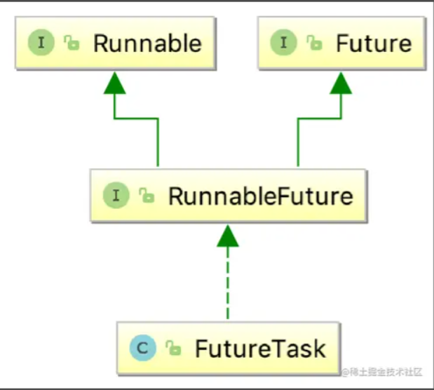

# 线程池

## 线程与进程的关系

- 进程：是资源分配的最小单位
- 进程：程序执行流的最小执行单位

多线程是实现异步的一种技术

一个进程可以有 1~n 个线程

## 创建线程的三个方法

##### 1. 继承 Thread 类

```java
package com.example.demo.thread;

public class ThreadTest extends Thread{

    public void run(){
        System.out.println("自定义线程的run方法执行了");
    }

    public static void main(String[] args) {
        new ThreadTest().start();
    }

}

```

##### 2. 通过实现 Runnable 接口

```java
public class RunnableThreadTest implements Runnable{

    @Override
    public void run() {
        System.out.println("自定义线程的run方法执行了");
    }

    public static void main(String[] args) {
        RunnableThreadTest runnableThreadTest=new RunnableThreadTest();
        new Thread(runnableThreadTest,"新线程1").start();
    }
}


```

###### 3. 通过 Callable 接口(重写的方法可以有返回值)

1.  自定义实现 Callable 接口，相较于实现 Runnable 接口的方式，重写的方法可以有返回值，并且可以抛出异常

```java

public class MyCallable implements Callable<String> {

    @Override
    public String call() throws Exception {
        Thread.sleep(5000);
        return "testCallable";
    }
}

```

2. 创建 FutureTask 对象

```java
MyCallable myCallable=new MyCallable();
FutureTask futureTask=new FutureTask(myCallable);
```



###### 一些解释

Future 最主要的作用是，比如一些比较耗时的操作，如果我们一直在原地等待方法返回，显然不明智，可以将耗时操作放在子线程里去执行，再通过 Future 去控制子线程执行的计算过程最后获取到计算结果

FutureTask 作为继承了 Runnable 接口和 Future 接口的 RunnableFuture 实现类，所以 FutureTask 既可以作为 Runnable 被线程执行，又可以作为 Future 作为 Callable 的返回值

FutureTask 有两个重要方法

> - isDone() 返回一个布尔值，表示 call 方法是否执行结束，不阻塞
> - get() 返回 call 方法的返回值，如果 call 方法未执行完会阻塞

3.

```java
new Thread(futureTask).start();

while(!futureTask.isDone()){
            System.out.println("未完成");
        }
System.out.println(futureTask.get());
```

## JDK 中的线程池

### 线程池

1. 提供了一个装线程的容易，现取现用，用完即还。避免了创建于销毁额外开销，提高了响应速度
2. 提供了一个任务队列，队列中保存着所有需要线程来执行的任务

### 线程池的体系结构

\- java.util.concurrent.Exectuor: 负责线程的使用与调度的根接口
\-- ExecutotService 子接口：线程池的主要接口
